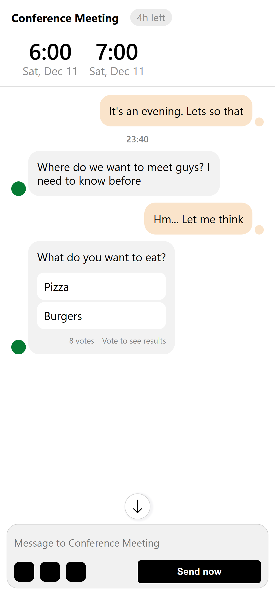

### Interface Initial

Request to create an application with infinite Checkboxes, whose behavior is to be able to add Checkboxes
just by editing a line of code, each Chekbox must be concatenated together with the message once the user enters a new
one.

It makes use of React hooks and references to create components dynamically.

Initially 3 Checkboxes are declared in the code, but by simply editing the line mentioned below, an infinite number of Checkboxes can be added.

For added more checkbox in the interface, modified this line:

```javascript
useCheckboxGroup(useMemo(() => ['sport', 'movies', 'finance'], []))
```

#### Requeriments

- Req. 1: Verify that a category is selected.
- Req. 2: Verify that the user write a message.

#### Screenshots

<p align="center" float="left">
  
</p>


### How to start

You will need to have Node.js and npm installed on your machine. Once you have those installed, you can follow these steps:

1. Open a terminal window and navigate to the directory where the project is located.
2. Run the following command to install all of the project's dependencies:

````shell
npm install
````

3. Once the dependencies have been installed, you can start the project by running the following command:

````shell
npm run dev
````

This will start a development server on your local machine.
