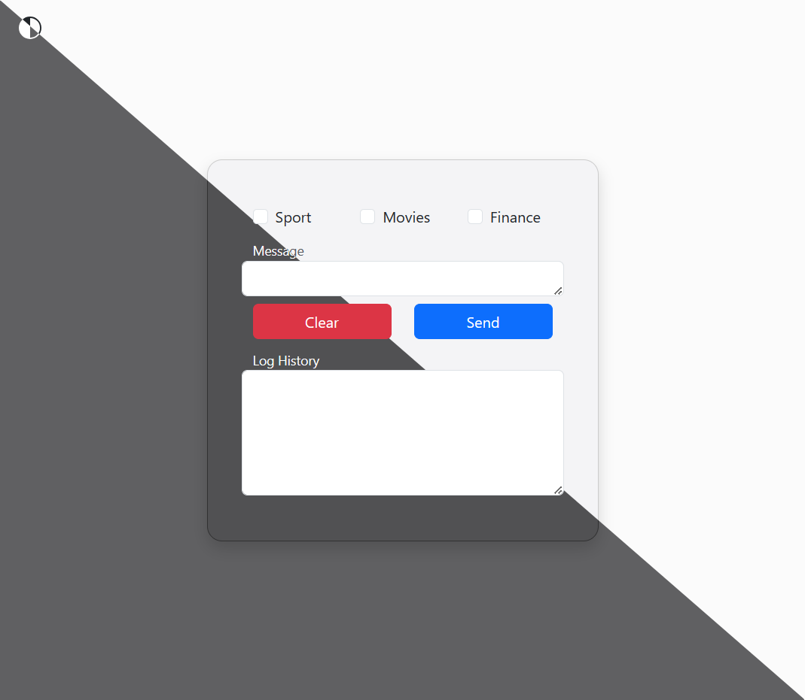
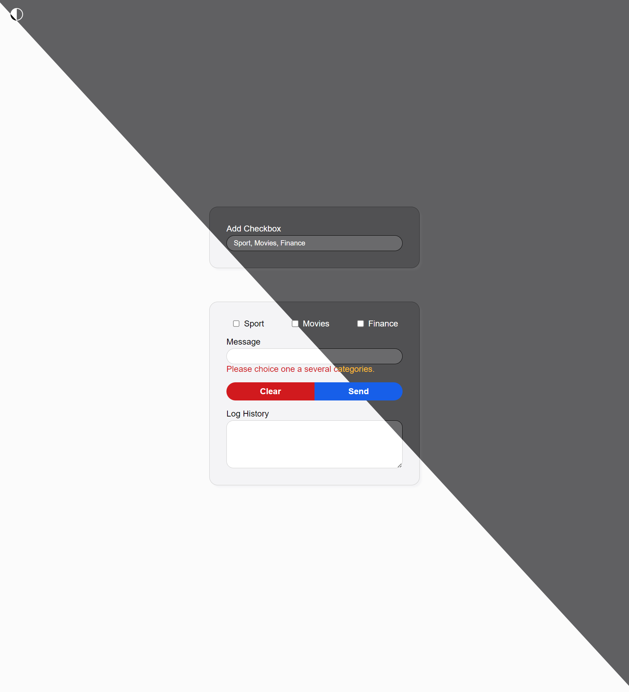
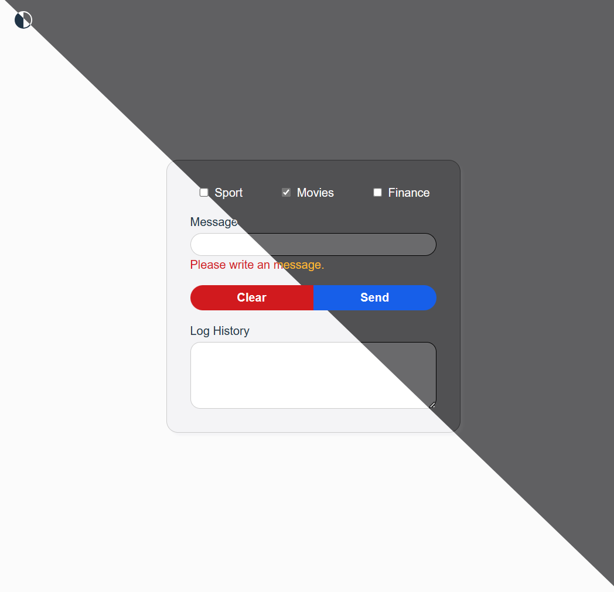

### Interface Initial

For added more checkbox in the interface, modified this line:

```javascript
useCheckboxGroup(useMemo(() => ['sport', 'movies', 'finance'], []))
```




Req. 1: Verify that a category is selected.



Req. 2: Verify that the user write a message.



### How to start

````shell
npm install & npm run dev
````
